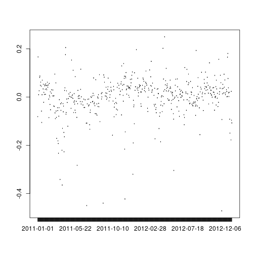

Bike Data Ratio
========================================================
author: Mark Barkell
date:  2018-01-28
autosize: true

# Casual Users VS Registered Users of Bike Loans

- Given weather and date information what will be the ratio of causual vs registered users.
- Such a ratio may be used to determine when to run on the spot promotion.
- Could such a ratio be used to improve conversions of causual users to be registered users?

The Output Floating Point
========================================================

The output of the program is the predicted ratio of casual users plus one divided by the registered uses.  The users are bike riders.

The input is weather conditions and calendar information which is desired to have the outcome predicted.

Plot of Resdiduals
========================================================

The following is a plot of the residuals of predicted vs actual of the training data:

What is the use?
========================================================

- Give registered users arm bands that say "Ask me about biking?" so to encorage users to register.
- Give causual users a discount to register on days predicted to have the ratio the administrator desires.

Data Providence 
========================================================

The data is real data from the following site:
 [Bike Sharing Dataset Data Set](https://archive.ics.uci.edu/ml/datasets/Bike+Sharing+Dataset#)
 
